eksisozluk
==========

A command line reader for https://eksisozluk.com/

### Supported Functionalities

* Read entries from titles of default channel(gundem)
* Read entries from titles of other channels
* Read entries of an author
* Save selected titles as favourite
* Get today's entries from favourite titles
* Save selected entries as favourite
* Show entries saved as favourite
* Change console output theme


## How to setup

If you will use MongoDB to save titles/entries, install it from [here](https://docs.mongodb.com/manual/administration/install-community/).
Otherwise SQLite database will be used.

You can check the running status after installation and start the database server with the following commands on Linux.

* `sudo service mongod status`
* `sudo service mongod start`

Run one of the followings to install required packages

* `pipenv install && pipenv shell`
* `pip install -r requirements.txt`


## How to use

```
usage: python eksisozluk.py [-h] [-ch] [-ae] [-ft] [-lfte] [-fe] [-lfe] [-th THEME]

optional arguments:
  -h, --help                 show this help message and exit
  -ch, --channels            Get titles from other channels
  -ae, --author_entries      Get author entries
  -ft, --favtitle            Add selected titles to favourites
  -lfte, --listfavtitleentry Get today's entries from favourite titles
  -fe, --faventry            Add selected entries to favourites
  -lfe, --listfaventry       Show entries saved as favourite
  -th THEME, --theme THEME   Change theme
```

## Screenshots

**Listing channels**

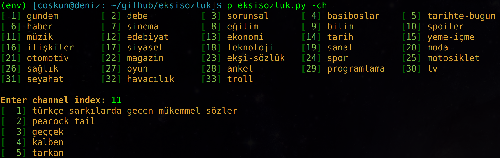

**Getting author entries**

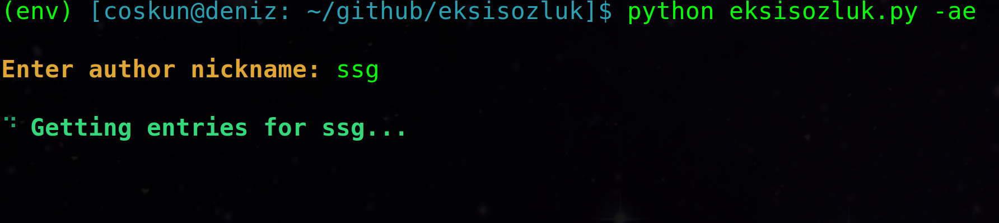

**Show entries from a title**

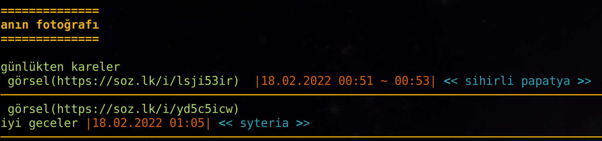

**Save entry to favourites**

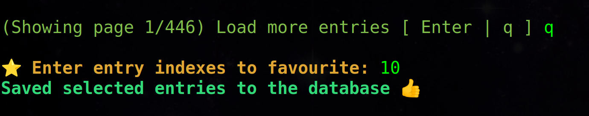

**Show favourite entries**

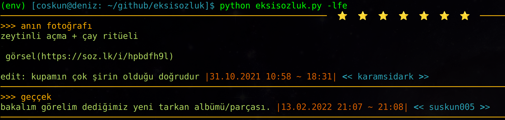

**Save titles to favourites**


**Save duplicate title**

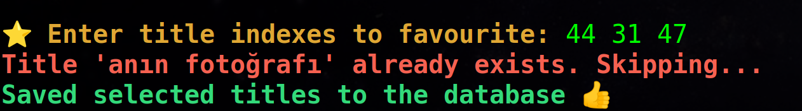

**Get entries from favourite titles**

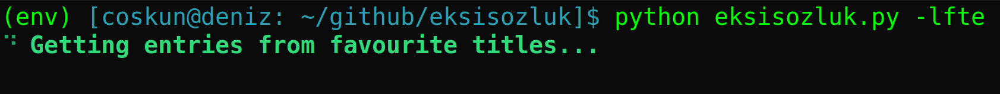

**Load more dialog for titles**


**Secondary theme with green variants**

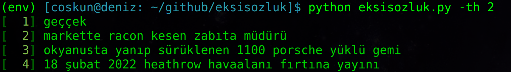

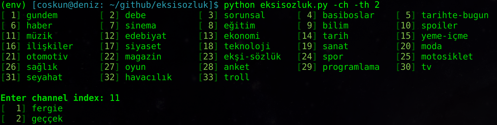

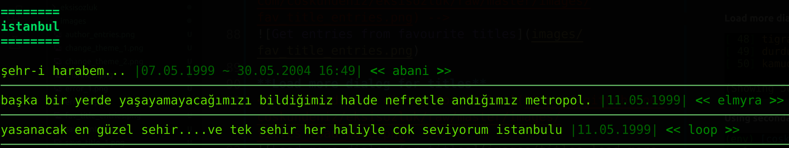

**Invalid input errors**

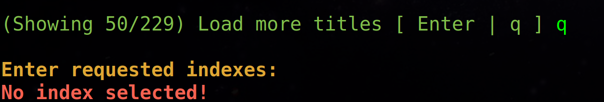


